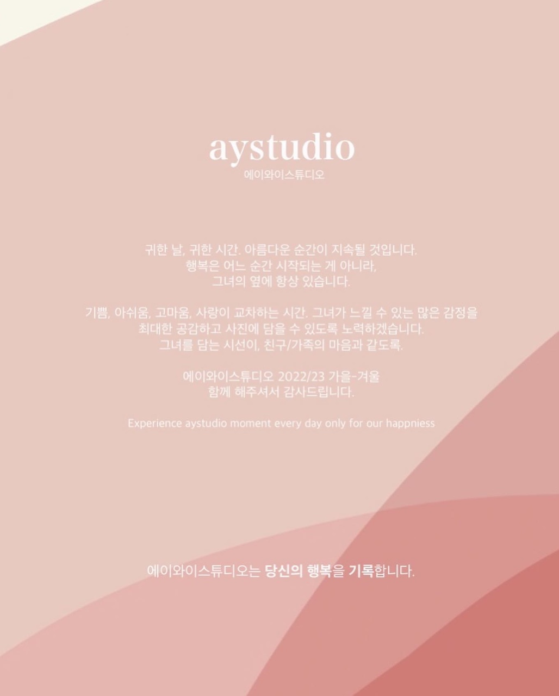

# 👋 Welcome to AYStudio!

<figure><figcaption></figcaption></figure>

> 귀한 날, 귀한 시간, 아름다운 순간이 지속될 것입니다.
>
> 행복은 어느 순간 시작되는 게 아니라 그녀의 옆에 항상 있습니다.
>
>
>
> 기쁨, 아쉬움, 고마움, 사랑이 교차하는 시간. 그녀가 느낄 수 있는 많은 감정을.
>
> 최대한 공감하고 사진에 담을 수 있도록 하겠습니다.
>
> 그녀를 담는 시선이, 친구/가족의 마음과 같도록.

> 에이와이스튜디오 22/23 가을-겨울
>
> 함께 해주셔서 감사드립니다.&#x20;
>
> Experience aystudio moment everyday only for our happiness

> — 에이와이스튜디오는 당신의 행복을 기록합니다.&#x20;

## Quick links


[what-we-do.md](overview/what-we-do.md)



[our-features.md](overview/our-features.md)


## Get Started

We've put together some helpful guides for you to get setup with our product quickly and easily.


[getting-set-up](fundamentals/getting-set-up/)



[setting-permissions.md](fundamentals/getting-set-up/setting-permissions.md)



[inviting-members.md](fundamentals/getting-set-up/inviting-members.md)

